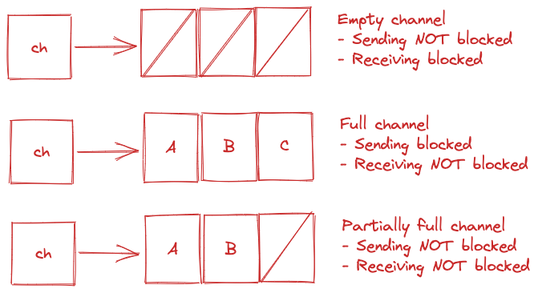

# gopl-book

[Book](http://www.gopl.io/)

## Why?

- Refresher on Golang basics
- Improve understanding of Go concurrency mechanisms

## Related efforts

- [UCI Go MOOC Exercises](https://github.com/mtanzim/go-uci)

## Notes on critical concepts

### Interfaces

- TODO

### Goroutines and Channels

- Go allows for two styles of concurrent programming
  1. **Communicating sequential processes (CSP)**: passing values between independent activities (goroutines)
  1. **Shared memory multithreading** (threads in most mainstream languages)

#### Goroutines

- Each concurrently executing activity is called a goroutine
- For example, imagine 2 independent functions
- In a sequential program, the functions are called one after the other
- In a concurrent program, both functions are active at once
- Goroutines are similar to an OS thread. This is a fair assumption for writing correct programs. Differences will be described later
- Upon a program start, the only goroutine is the `main` function; this is known as the `main goroutine`
- New goroutines can be created with the `go` statement, ie:

```go
f() // call f, await return
go f() // create a goroutine to call f(), DO NOT wait
```

- Examples
  - [spinner](ch8/spinner/main.go)
  - [clock](ch8/clock2/main.go)
  - [echo server](ch8/reverb2/main.go)

#### Channels

- Goroutines are the activities of concurrent programs, and `channels` are the connections between them
- It is a communication mechanism through which one goroutine can can send values to another goroutine
- Channels carry value of an _element type_
- The built in `make` function can create channels

```go
ch := make (chan int)
```

- Channels are reference types similar to maps and slices. Therefore, copying channels, passing them as arguments copies a _reference_ referring to the same data structure
- The zero value of channels is `nil`
- Channels allow two operations, _send_ and _receive_, collectively known as _communications_; both use the `<-` operator

```go
ch <- x // a send statement
x = <- ch // a receive statement
<- ch // receive, discard result
```

- Channels also support a `close` operation
- Closed channels indicate that no more values will be sent; subsequent attempts at send will panic
- Closed channels can be received from until drained, and all values after will be the zero value of the channel _element type_
- Channels can be _buffered_ or _unbuffered_, _unbuffered_ channels have non-zero _capacity_; details will be explained in the following section

```go
ch = make(chan int) // unbuffered channel
ch = make(chan int) // unbuffered channel
ch = make(chan int, 3) // buffered channel with capacity of 3
```

##### Unbuffered Channels

- Unbuffered channels are a synchronization mechanism, and are often called _synchronous_ channels
- A send operation on an unbuffered channel blocks the sending goroutine until the message has been received by another goroutine
- Similarly, if a receive is attempted first, the receiving goroutine blocks until a message is sent on the channel by another goroutine
- Note [spinner2](ch8/spinner2/main.go) for an example of a simple unbuffered channel
- Channels can often carry no value, and simply be used for synchronization, in these cases, we call messages `events`
- `events` are conventionally denoted with the element type of `struct {}`, however, `bool` and `int` are also common
- Note [spinner3](ch8/spinner3/main.go) for an example of a simple unbuffered channel with events

##### Pipelines

- Channels can be used to create a pipeline between asynchronous processes
- See the following [pipeline example](ch8/pipeline1/main.go), also demonstrated below in the diagram


- Channels can be closed if it it is important for the sender communicate that no more values will be produced
- Sending on a closed channel causes a panic
- After the closed channel is drained, subsequent attempts at receiving will yield a zero valye of the element type
- The receiving operation can check if a channel is closed, ie:

```go
for {
  x, ok := <- naturals
  squares <- x*x
  if !ok {
    break
  }
}
```

- A more convenient syntax is as follows:

```go
for x:= range naturals {
  squares <- x*x
}
close(squares)
```

- See the complete example in [pipeline2](ch8/pipeline2/main.go)
- Note that the garbage collector will clean up unreachable channels, and therefore it is only important to close them if we wish to communicate that receiving goroutines will no longer need to wait for a value on the channel
- Additionally, channels can be marked as unidirectional, ie:

```go
func counter(out chan<- int){
  for x:=0; x < 100; x++ {
    out <-x
  }
  close(out)
}
```

- Note the full example in [pipeline3](ch8/pipeline3/main.go), particularly the automatic type conversion from bidirectional to unidirectional channels
- The reverse conversion is not permitted or valid

##### Buffered Channels

- Buffered channels hold a _queue_ of values (FIFO), sending adds a value to the back, receiving removes a value from the front
- See the following diagram for the blocking mechanism on send/receive



- A buffered channel can be instantiated with

```go
ch = make (chan string, 3)
```

- `len` can be used to query the buffer capacity
- Buffered channels are used to communicate between different goroutines, do not use them as a simple queue as there is a risk of deadlock
- The following is an example of buffered channel usage

```go
func query() {
  responses := make(chan string, 3)
  go func() {responses <- request("https://httpbin.org/image/jpeg")}()
  go func() {responses <- request("https://httpbin.org/image/svg")}()
  go func() {responses <- request("https://httpbin.org/image/png")}()
  return <- responses
}
```

- Note that the usage of on unbuffered channel will cause the two slower goroutines to have no one to receive their message and therefore getting stuck forever; this is known as a _goroutine leak_
- The full example can be found [here](ch8/bufChannel/main.go)
- Note that the choice of buffered vs unbuffered, as well as the capacity of the buffered channel affects both performance and correctness of the program; watch for goroutine leaks that may add up over time to cause hangs and slowdowns
- Goroutine leaks are not automatically collected by the garbage collector

##### Looping in parallel

- A very common concurrency pattern is to run iterations of a loop in parallel
- Examples of this can be seen in the [thumbnail generator example](ch8/thumbnail/main.go)
- Note particularly the `makeThumbnails6` function, for which we perform the following steps:
  1. Make channels for input and output
  1. Fire off a function concurrently, passing the communication channels
  1. Produce on the input channel from the `main` function
  1. Listen on the input channel inside `makeThumbnails6`, perform all required tasks, and signal closure on the output channel with the help of `sync.WaitGroup`. This is a special counter that safely increments and decrements as goroutines start up and close off.
  1. Iterate over the output channel inside the `main` function and summarize the results, which is summing the number of bytes written in this case
- Also note the [concurrent web crawler example](ch8/crawl/main.go). Highlighting the key concepts used:
  - Crawler goroutines are fed through the `unseenLinks` channel
  - The seen map is _confined_ to the `main` goroutine, this ensures correctness and prevent unnecessary information sharing
  - Links found by crawl are sent to the worklist from yet another goroutine to avoid deadlocks

##### Multiplexing with `select`

- We can listen from several channels and multiplex based on their responses using a `select` statement
- `select` statements are like switch statements, where it has a number of a cases, and a `default`
- Each case can specify a _communication_ and its associated actions with a block of statements

```go
select {
  case <-ch1:
    // ...
  case x: <-ch2:
    // do something with x
  case ch3 <- y:
    // ...
  default:
    // ..
  }
```

- `select` waits until _communication_ on some channel is ready
- An empty select, ie: `select{}` waits forever
- If multiple cases are ready, `select` picks at random
- To avoid blocking behaviour if desired, ensure usage of `default`
- See the [countdown](ch8/countdown1/main.go) for example usage of `select`

##### Cancellations

- There is no way for one goroutine to stop another, doing so would leave shared variables in an undefined state
- In the [countdown](ch8/countdown1/main.go), we sent a single value over a channel, but note that a message over a channel can only be consumed once. Thus, how do we signal multiple goroutines to stop?
- One solution may be to send multiple cancel messages, but it is difficult to know how many goroutines may be operating at a time
- Note that once a channel is closed and drained, all subsequent receive operations yield a zero value
- We can exploit this behaviour for a _broadcast_ message
- See [broadcast](ch8/broadcast/main.go) for an example

##### [Chat Example](ch8/chat/main.go)

### Concurrency with shared variables

- TODO

### Testing

- Similar to other aspects in the language, Go has a very minimal approach to testing frameworks:
  - Writing test code is very similar to writing the program itself
  - Write short functions focusing on a single task
  - Be careful about boundary conditions
  - Be careful about selecting and using data structures
  - Think about what inputs result in what outputs
- Due to the similarity, the belief is that the same conventions, notations and tools can be applied to testing as well as writing Go code
- `go test` is a the test driver for Go packages
- Files suffixed with `_test.go` are not part of the `go build` process, but rather the `go test` process
- Test files can contain:
  1. Test functions that result in either PASS or FAIL
  1. Benchmark functions
  1. Example functions
- Let's focus on test functions first

### Test Functions

- Test files have to import the `testing` package, and must follow the follow signature:

```go
func TestName(t *testing.T){
  //
}
```

- The optional suffix `Name` must also begin with a capital letter, ie:

```go
func TestSin(t *testing.T){ // }
func TestCos(t *testing.T){ // }
```

- See the [palindrome](ch11/word1/word_test.go) tests for a very basic example
- To run the above tests, we can simple navigate to the package and run `go test`

```bash
cd ./ch11/word1/
go test
```

- On the latter 2 tests, note the usage of `t.Errorf` to avoid repetition
- Also note that 2 of the tests fail. If we want to only run the failing tests, we may use the `-run` flag, which takes a regular expression, ie:

```bash
cd ./ch11/word1/
go test -v -run="French|Canal"
```

- As one may note, writing tests like this becomes tedious, and thus, table driven tests are very popular in go
  - See [example](./ch11/word2/word_test.go)
- One may use `t.Fatalf` if a test function must be stopped in its tracks. This is generally not recommended
